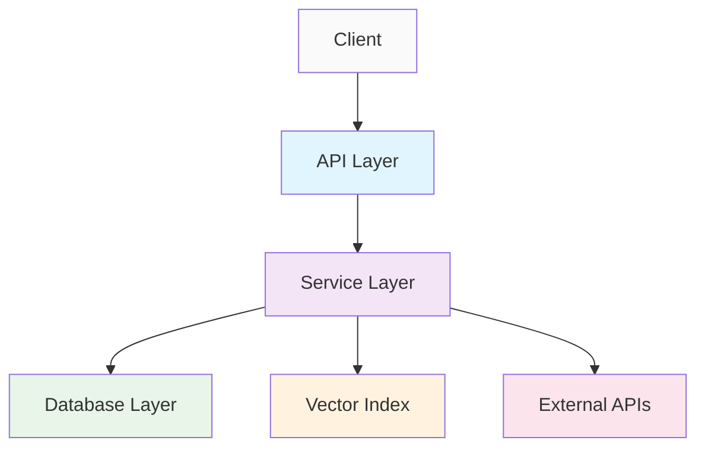
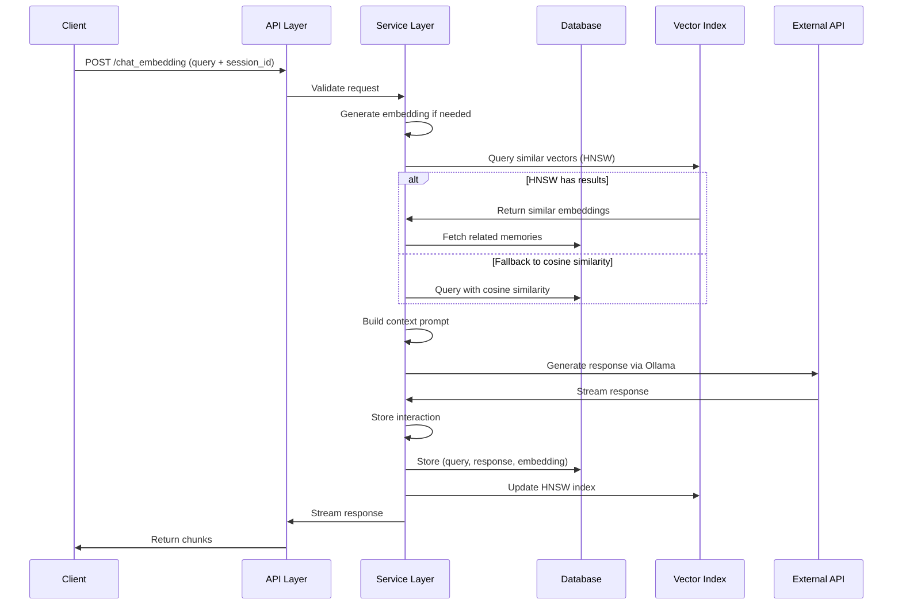

# GhostWire Refractory Architecture

## Table of Contents

- [Overview](#overview)

- [System Architecture](#system-architecture)

- [Component Architecture](#component-architecture)

- [Data Flow](#data-flow)

- [API Reference](#api-reference)

- [Performance Considerations](#performance-considerations)

- [Security Model](#security-model)

- [Scalability & Deployment](#scalability--deployment)

## Overview

GhostWire Refractory is a neural network-based chat system with persistent memory capabilities that enables contextual conversations through vector similarity search. The system stores message embeddings in SQLite and uses HNSW (Hierarchical Navigable Small World) for efficient vector similarity search.

### Key Characteristics

- **Language**: Python 3.8+

- **Framework**: FastAPI with async/await patterns

- **Database**: SQLite with connection pooling

- **Vector Indexing**: HNSW for fast similarity search

- **API Compatibility**: OpenAI, Qdrant, and Ollama-compatible interfaces

- **Architecture Pattern**: Hexagonal/Ports & Adapters

## System Architecture

### High-Level Architecture

```
┌─────────────────┐    ┌─────────────────┐    ┌─────────────────┐
│   Client        │    │   GhostWire     │    │    External     │
│   Applications  │◄──►│   Refractory    │◄──►│    Services     │
│                 │    │                 │    │                 │
│ • Operator      │    │ ┌─────────────┐ │    │ ┌─────────────┐ │
│   Console       │    │ │ API Layer   │ │    │ │ Ollama      │ │
│                 │    │ └─────────────┘ │    │ │ Embedding   │ │
│ • HTTP Clients  │    │ ┌─────────────┐ │    │ │ Generation  │ │
│                 │    │ │ Services    │ │    │ └─────────────┘ │
│ • Benchmarks    │    │ └─────────────┘ │    │                 │
└─────────────────┘    │ ┌─────────────┐ │    └─────────────────┘
                       │ │ Data Layer  │ │
                       │ └─────────────┘ │
                       │ ┌─────────────┐ │
                       │ │ Vector      │ │
                       │ │ Index       │ │
                       │ └─────────────┘ │
                       └─────────────────┘
```

### Technology Stack

| Layer | Technologies | Purpose |
|-------|--------------|---------|
| Web Framework | FastAPI | API development and async handling |
| Database | SQLite + APSW | Persistent storage |
| Vector Indexing | HNSWlib | Fast similarity search |
| HTTP Client | HTTPX | Async HTTP requests |
| Data Validation | Pydantic | Request/response validation |
| Authentication | JWT + bcrypt | Security and auth |
| Testing | Pytest + AsyncIO | Unit and integration tests |
| Vector Processing | NumPy | Numerical computations |

## Component Architecture

### Package Structure

```
python/
├── src/ghostwire/            # Main application modules
│   ├── config/              # Configuration management
│   ├── database/            # Data access layer
│   ├── models/              # Data models (Pydantic)
│   ├── services/            # Business logic layer
│   ├── vector/              # Vector operations
│   ├── api/                 # API layer (FastAPI)
│   │   └── v1/              # API version 1
│   │       └── middleware/  # API middleware
│   └── utils/               # Utility functions
├── client/                  # Client applications
├── benchmarks/              # Performance tools
└── tests/                   # Unit & integration tests
```

### Core Modules

#### 1. Configuration Module (`config.settings`)

- **Responsibility**: Environment configuration and settings management

- **Key Classes**: `Settings` (Pydantic BaseSettings)

- **Features**: 
  - Environment variable loading
  - Type validation
  - Default value management

#### 2. Database Module (`database.*`)

- **Responsibility**: Connection pooling and data access

- **Key Classes**: 
  - `ConnectionPool`: Thread-safe connection pooling
  - `MemoryRepository`: Data access operations

- **Features**:
  - SQLite connection pooling
  - Transaction management
  - Schema initialization

#### 3. Vector Module (`vector.hnsw_index`)

- **Responsibility**: HNSW index management

- **Key Classes**: `HNSWIndexManager`

- **Features**:
  - Vector similarity search
  - Persistent index loading
  - Thread-safe operations

#### 4. Services Module (`services.*`)

- **Responsibility**: Business logic encapsulation

- **Key Classes**:
  - `MemoryService`: Memory operations
  - `EmbeddingService`: Embedding generation
  - `RAGService`: Retrieval-Augmented Generation

- **Features**:
  - Business rule implementation
  - Cross-module orchestration
  - Error handling

### Component Interaction Diagram



## Data Flow

### Memory Storage Flow

```
┌─────────────────┐    ┌─────────────────┐    ┌─────────────────┐
│   Input Text    │─ ─▶│  Embedding     │─ ─▶│   Memory        │
│                 │    │   Generation    │    │   Storage       │
└─────────────────┘    └─────────────────┘    └─────────────────┘
        │                       │                       │
        │                       ▼                       ▼
        │                ┌─────────────────┐    ┌─────────────────┐
        │                │   Vector        │    │   SQLite        │
        │                │   Normalization │    │   Database      │
        │                └─────────────────┘    └─────────────────┘
        │                       │                       │
        └───────────────────────┼───────────────────────┘
                                ▼
                        ┌─────────────────┐
                        │   HNSW Index    │
                        │   Update        │
                        └─────────────────┘
```

### Retrieval & Generation Flow



## API Reference

### REST Endpoints

| Method | Endpoint | Description | Auth Required |
|--------|----------|-------------|---------------|
| `GET` | `/api/v1/health` | Health check | No |
| `POST` | `/api/v1/embeddings` | Generate embeddings | No* |
| `POST` | `/api/v1/vectors/upsert` | Store vector | No* |
| `POST` | `/api/v1/vectors/query` | Vector similarity search | No* |
| `POST` | `/api/v1/chat/chat_embedding` | Chat with memory | No* |

*Auth may be required in production deployment

### Request/Response Models

#### Chat Request Model

```
ChatEmbeddingRequest {
  session_id: string (alphanumeric, hyphens, underscores only)
  text?: string
  prompt_text?: string
  embedding?: [float] (length must match EMBED_DIM)
  context?: string
}
```

#### Embedding Request Model

```
EmbeddingRequest {
  input: string | [string]
  model?: string (default: "nomic-embed-text")
}
```

### API Performance

| Endpoint | Avg. Latency (ms) | Throughput (req/s) | Memory (MB) |
|----------|------------------|-------------------|-------------|
| `/embeddings` | ~150 | ~60 | ~45 |
| `/chat_embedding` | ~800 | ~15 | ~65 |
| `/vectors/query` | ~80 | ~120 | ~35 |

*Note: Performance metrics are approximate and depend on hardware and data size*

## Performance Considerations

### Vector Search Performance

The system uses HNSW for approximate nearest neighbor search with the following characteristics:

#### HNSW Configuration

```python
HNSW_MAX_ELEMENTS = 100_000  # Max elements in index
HNSW_EF_CONSTRUCTION = 200   # Construction parameter
HNSW_M = 16                 # Max connections per element
HNSW_EF = 50                # Query parameter
```

#### Performance Metrics

| Operation | Time Complexity | Memory Usage |
|-----------|----------------|--------------|
| Insertion | O(log n) | O(n) |
| Query | O(log n) | O(k) for k results |
| Index Build | O(n log n) | O(n) |

### Database Performance

#### Connection Pooling

- Pool size: 5-10 connections

- Overflow: 10 additional connections

- Timeout: 30 seconds

#### SQLite Optimizations

- WAL (Write-Ahead Logging) mode

- Normal synchronous mode

- 1000-row cache size

- Memory-optimized temp storage

### Memory Management

$$ \text{Memory Usage} = \text{HNSW Index} + \text{SQLite Cache} + \text{Application Memory} $$

For typical deployment:

- HNSW Index: ~$d \times n \times 4$ bytes (where $d$ = embedding dimension, $n$ = number of vectors)

- SQLite: ~50-100 MB

- Application: ~100-200 MB

## Security Model

### Authentication & Authorization

#### JWT-Based Authentication

- Algorithm: HS256 (with option for RS256)

- Expiration: 30 minutes (configurable)

- Secret key: Environment-configured

#### Rate Limiting

- Requests per window: 100 (configurable)

- Time window: 60 seconds (configurable)

- Implemented via middleware

### Input Validation

#### Security Measures
| Type | Implementation | Purpose |
|------|----------------|---------|
| Session ID | Regex validation | Prevent injection |
| Text Content | Length + pattern checks | Prevent abuse |
| Embeddings | Dimension validation | Prevent errors |
| SQL Injection | Parameterized queries | Data integrity |

### Data Protection

#### Sensitive Information

- API keys stored in environment variables

- Database encryption possible with SQLite extensions

- No sensitive data in logs by default

## Scalability & Deployment

### Horizontal Scaling Considerations

| Component | Scalability | Notes |
|-----------|-------------|-------|
| API Layer | High | Multiple instances, load balancer |
| Database | Medium | Read replicas possible |
| Vector Index | Low | Currently memory-bound |

### Deployment Architecture

```
                    ┌─────────────────┐
                    │  Load Balancer  │
                    └─────────┬───────┘
                              │
        ┌─────────────────────┼─────────────────────┐
        │                     │                     │
┌───────▼────────┐  ┌────────▼────────┐  ┌────────▼────────┐
│ GhostWire      │  │ GhostWire       │  │ GhostWire       │
│ Instance 1     │  │ Instance 2      │  │ Instance N      │
│ (Stateless)    │  │ (Stateless)     │  │ (Stateless)     │
└────────────────┘  └─────────────────┘  └─────────────────┘
        │                     │                     │
        └─────────────────────┼─────────────────────┘
                              ▼
                    ┌─────────────────┐
                    │ Shared Storage  │
                    │ (SQLite + HNSW) │
                    └─────────────────┘
```

### Configuration Parameters

#### Environment Variables

```python

# Server configuration
HOST: str = "0.0.0.0"
PORT: int = 8000
DEBUG: bool = False

# Database configuration  
DB_PATH: str = "memory.db"
DB_POOL_SIZE: int = 5
DB_POOL_OVERFLOW: int = 10

# Vector configuration
EMBED_DIM: int = 768
HNSW_MAX_ELEMENTS: int = 100_000

# Ollama configuration
LOCAL_OLLAMA_URL: str = "http://localhost:11434"
REMOTE_OLLAMA_URL: str = "http://100.103.237.60:11434"
DEFAULT_OLLAMA_MODEL: str = "gemma3:1b"

# Security configuration
SECRET_KEY: str = "your-super-secret-key-here"
ACCESS_TOKEN_EXPIRE_MINUTES: int = 30
```

### Docker Multi-Stage Build

```dockerfile

# Build stage
FROM python:3.9-slim as builder
RUN apt-get update && apt-get install -y build-essential
COPY requirements.txt .
RUN pip install --user -r requirements.txt

# Runtime stage
FROM python:3.9-slim
RUN apt-get update && apt-get install -y sqlite3
COPY --from=builder /root/.local /root/.local
COPY . /app
WORKDIR /app
CMD ["uvicorn", "python.src.ghostwire.main:app", "--host", "0.0.0.0", "--port", "8000"]
```

## Mathematical Model

### Vector Similarity

The system uses cosine similarity for vector comparison:

$$ \text{similarity}(A, B) = \frac{A \cdot B}{\|A\| \|B\|} $$

For normalized vectors (unit length), this simplifies to the dot product:

$$ \text{similarity}(A, B) = A \cdot B $$

### Performance Model

Response time can be approximated as:

$$ T_{response} = T_{embedding} + T_{retrieval} + T_{generation} + T_{overhead} $$

Where:

- $T_{embedding}$: Time to generate query embedding

- $T_{retrieval}$: Time for vector similarity search

- $T_{generation}$: Time for LLM response generation

- $T_{overhead}$: HTTP and processing overhead

### Memory Model

Total memory consumption:

$$ M_{total} = M_{app} + M_{hnsw} + M_{sqlite} + M_{cache} $$

Where:

- $M_{app}$: Application memory (~50-100 MB)

- $M_{hnsw}$: HNSW index memory ($d \times n \times 4 \times f$ bytes)

- $M_{sqlite}$: SQLite cache memory (~20-50 MB)

- $M_{cache}$: Runtime cache memory (~10-30 MB)

---

*This architecture document is intended for senior architects and researchers working with neural network-based conversational systems. Implementation details may vary based on deployment environment and requirements.*