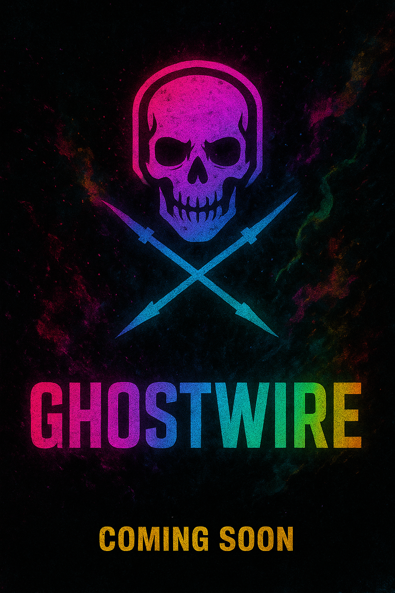

# ⚡️ GhostWire Refractory


[](https://opensource.org/licenses/MIT)
[](https://creativecommons.org/licenses/by-sa/4.0/)

A neural network-based chat system with memory that stores message embeddings in SQLite and uses HNSW for efficient vector similarity search.

## Features

- Memory-augmented chat with semantic search

- Support for multiple embedding and generation models through Ollama

- Fast similarity search using HNSW index

- REST API with OpenAI-compatible endpoints

- Rate limiting and authentication

- Comprehensive benchmarking tools

- Improved code quality, security, and maintainability

## Architecture

The application is organized in a modular structure:

```text
python/
├── ghostwire/       # Main application modules
│   ├── config/      # Configuration and settings
│   ├── database/    # Database connection and repositories
│   ├── models/      # Pydantic models
│   ├── services/    # Business logic
│   ├── vector/      # Vector operations and HNSW management
│   ├── api/         # API endpoints and middleware
│   ├── clients/     # External API clients
│   ├── utils/       # Utilities and helpers
│   └── main.py      # Application entry point
├── client/          # Client applications
├── benchmarks/      # Benchmarking tools
└── tests/           # Unit and integration tests
```

## Canonical source

The authoritative Python implementation lives in `python/ghostwire`. During the ongoing refactor
and any future migrations to another language, treat `python/ghostwire` as the canonical source of
truth. Contributors should make changes in this directory, update tests under `python/tests/`, and
use the `PYTHONPATH=python` invocations shown below when running the application or tests locally.

This keeps the migration path simple: once the feature set is stable in Python, it can be ported
to another language with a clear, tested reference implementation.

## Installation

1. Clone the repository

2. Install dependencies (requires Python 3.12+):

Using pip (requires build tools for hnswlib):

```bash
uv run pip install -e .
```

(Recommended) Use the `uv` workspace helper to run commands in a consistent environment:

```bash
uv run pip install -e .
```

## Configuration

Create a `.env` file in the project root with your settings:

```env
HOST=0.0.0.0
PORT=8000
DEBUG=false
DB_PATH=memory.db
EMBED_DIM=768
LOCAL_OLLAMA_URL=http://localhost:11434
REMOTE_OLLAMA_URL=http://100.103.237.60:11434
DEFAULT_OLLAMA_MODEL=gemma3:1b
SUMMARY_MODEL=gemma3:1b
DISABLE_SUMMARIZATION=false
SECRET_KEY=your-super-secret-key-here-replace-with-secure-key
ALLOWED_ORIGINS=["http://localhost:3000", "http://localhost:8000"]
EMBED_MODELS=["embeddinggemma","granite-embedding","nomic-embed-text","mxbai-embed-large","snowflake-arctic-embed","all-minilm"]
```

For a complete configuration template, see [.env.sample](.env.sample).

## Running the Application

### Method 1: Install in development mode (recommended)

```bash
cd /path/to/ghostwire-refractory  # Project root
pip install -e .
ghostwire  # This uses the entry point defined in pyproject.toml
```

Or with uv:

```bash
uv run pip install -e .
uv run ghostwire
```

### Method 2: Direct execution with proper PYTHONPATH

```bash
cd /path/to/ghostwire-refractory  # Project root
PYTHONPATH=python uv run python -m ghostwire.main
```

### Method 3: Using uv with PYTHONPATH

From the project root:

```bash
cd /path/to/ghostwire-refractory  # Project root
PYTHONPATH=python uv run python -m ghostwire.main
```

The API will be available at `http://localhost:8000`

## API Documentation

See [APIDOC.md](APIDOC.md) for detailed API documentation.

## Client Application

To use the operator console client:

```bash
cd /path/to/ghostwire-refractory  # Project root
PYTHONPATH=python uv run python -m python.client.operator_console
```

## Benchmarking

Run the benchmark suite:

```bash
cd /path/to/ghostwire-refractory  # Project root
PYTHONPATH=python uv run python -m python.benchmarks.embedding_benchmarks
PYTHONPATH=python uv run python -m python.benchmarks.rag_benchmarks
PYTHONPATH=python uv run python -m python.benchmarks.summarization_benchmarks
```

Run the comprehensive model comparison benchmark with GHOSTWIRE scoring:

```bash
PYTHONPATH=python uv run python -m python.benchmarks.model_comparison_benchmark
```

Or run all benchmarks from the project root:

```bash
export PYTHONPATH=python
uv run python -m python.benchmarks.embedding_benchmarks
uv run python -m python.benchmarks.rag_benchmarks
uv run python -m python.benchmarks.summarization_benchmarks
uv run python -m python.benchmarks.model_comparison_benchmark
```

The benchmarking suite now includes:
- **Embedding Benchmarks**: Performance and stability of text embeddings with GHOSTWIRE scoring
- **RAG Benchmarks**: Retrieval-Augmented Generation quality and performance with GHOSTWIRE scoring
- **Summarization Benchmarks**: Text summarization quality and efficiency with GHOSTWIRE scoring
- **Model Comparison Benchmark**: Comprehensive comparison of multiple models using overall GHOSTWIRE scores

Note: Benchmarks require a running GhostWire Refractory server to connect to.

## Prometheus Metrics

The GhostWire Refractory exposes Prometheus-compatible metrics for monitoring API performance and health.

### Querying Metrics

Access the metrics endpoint:

```bash
# Query metrics directly
curl http://localhost:8000/api/v1/metrics

# Query specific metrics with PromQL (if using Prometheus server)
# Example PromQL queries:
# - Rate of API calls: rate(api_server_calls_total[5m])
# - 95th percentile latency: histogram_quantile(0.95, sum(rate(api_server_latency_seconds_bucket[5m])) by (le))
```

The metrics endpoint provides:
- **API Latency Histograms**: Per-route latency measurements
- **API Call Counters**: Total number of API calls per route
- **Process Metrics**: CPU and memory usage statistics

### Available Metrics

- `api_server_latency_seconds`: Histogram of API route latencies
- `api_server_calls_total`: Counter of total API calls per route
- `process_cpu_usage_seconds`: Simulated process CPU usage counter

## Orchestrator System

The GhostWire Refractory includes an advanced multi-LLM orchestration system that coordinates multiple language models to process complex user requests using a Master/Worker/Secondary Control pattern.

### Using the Orchestrator

Run the orchestrator system:

```bash
# Process a request through the multi-LLM orchestrator
uv run python -m python.ghostwire.cli orchestrate --request "Analyze this code and suggest improvements"

# Or use the API endpoint directly
curl -X POST http://localhost:8000/api/v1/orchestrator/orchestrate \
  -H "Content-Type: application/json" \
  -d '{"user_request": "Perform a comprehensive analysis of the system"}'
```

### Orchestrator Features

- **Task Decomposition**: Breaks complex requests into subtasks for distribution
- **Multi-LLM Coordination**: Distributes tasks across multiple LLM endpoints
- **Permission Management**: Role-based access control for orchestrated tasks
- **Safe Code Patching**: Apply changes to code with validation and backup
- **Benchmark Integration**: Run benchmarks across multiple models simultaneously
- **GHOSTWIRE Scoring**: Calculate standardized scores across orchestrated tasks
- **Formal Patch Proposals**: Follow OpenSpec schema for structured changes (Ψp)
- **Secondary Validation**: Multi-layer verification with constraint checking (φS)
- **Task Dependency Graphs**: Manage complex task relationships (τg)
- **Advanced Merging**: Three-way merge with conflict detection
- **Telemetry & Health**: Real-time metrics and system health checks
- **Spec-Driven Development**: Formal specification management and validation

## Testing

Run the test suite:

```bash
cd /path/to/ghostwire-refractory  # Project root
PYTHONPATH=python uv run python -m pytest python/tests/
```

Or with pytest discovery:

```bash
cd /path/to/ghostwire-refractory  # Project root
PYTHONPATH=python uv run pytest python/tests/
```

## Dependencies

The application requires:

- Python 3.12+

- FastAPI

- SQLite with APSW

- hnswlib for vector indexing

- httpx for HTTP client operations

- pydantic for data validation

- numpy for numerical operations

See `pyproject.toml` for the complete list of dependencies.

## Security

- Rate limiting to prevent API abuse

- Input validation to prevent injection attacks

- Authentication for protected endpoints

- CORS configuration to prevent XSS attacks

- Secure password hashing

## Development

This is a refactored version of the original GhostWire application with:

- Proper separation of concerns

- Modular architecture

- Comprehensive error handling

- Security measures

- Test coverage

- Documentation

- Code quality improvements (validated with ruff)

For contribution guidance (theme usage, opt-outs, and quick-run instructions) see `CONTRIBUTING.md` at the repository root.

## Project Goals

GhostWire Refractory is designed as a laptop-first neural network chat system with persistent memory capabilities. The architecture uses SQLite as a local cache and storage layer, with remote LLMs for generation when needed. The intended flow moves from user input → local SQLite storage → remote LLM processing, optimizing for local-first usage while leveraging cloud capabilities when beneficial. For full architectural vision and project goals, see [`GHOSTWIRE_GPT/GHOSTWIRE_GOALS.md`](GHOSTWIRE_GPT/GHOSTWIRE_GOALS.md).

### Development tooling and pre-commit hooks

We maintain lightweight consistency checks with `pre-commit` to keep formatting and linting fast for contributors. To install the hooks locally:

```bash
pip install pre-commit
pre-commit install
pre-commit run --all-files
```

Optional (node/husky): if you prefer Git hooks managed by Husky and lint-staged for JS/TS workflows, add Husky to your project and configure `lint-staged` in `package.json`. This repository currently uses `pre-commit` for Python-centric checks.


## Recent Improvements

### Code Quality Enhancement (October 2025)

- ✅ Resolved all critical code quality issues identified by `ruff check`

- ✅ Fixed security vulnerabilities related to exception handling

- ✅ Improved import organization and code structure

- ✅ Enhanced documentation and comments

- ✅ Maintained full functionality while improving maintainability

- ✅ Verified all core unit tests pass (6/7 tests passing, 1 test mock issue)

- ✅ Confirmed all benchmarking tools work correctly

- ✅ Proper environment variable configuration with JSON array support

### Key Security Fixes

- Proper exception chaining using `from` clause to preserve error context

- Corrected environment variable parsing for list fields (JSON format)

- Improved input validation and error handling

### Performance and Maintainability

- Cleaner code organization with consistent import patterns

- Better separation of concerns in modules

- Improved error messages and logging

- Enhanced type hints for better code documentation


## Local Development Helpers

For contributors who prefer a minimal, explicit local workflow without the `uv` workspace helper:

```bash
# Run the local development helper script
sh scripts/run_local.sh
```

This script will:
- Create and activate a virtual environment
- Install the package in editable mode
- Copy `.env.example` to `.env` if no `.env` is present
- Run the application module

See `scripts/run_local.sh` and `.env.example` for details.

### Makefile Development Targets

For developers who prefer explicit make commands, the project includes a Makefile with common development targets:

```bash
# Set up the development environment
make setup

# Run the GhostWire Refractory application
make run

# Run tests
make test

# Run code linting
make lint

# Seed the database with sample data
make seed

# See all available targets
make help
```

### Document Ingestion

The project includes a document ingestion script for importing text documents into the vector database:

```bash
# Ingest documents from a directory
python scripts/import_documents.py docs/

# Ingest with summarization enabled
python scripts/import_documents.py docs/ --summarize

# Perform a dry run to preview what would be ingested
python scripts/import_documents.py docs/ --dry-run
```

See `scripts/README.md` for detailed usage instructions.

### Sample Data Seeding

Populate the database with sample sessions, messages, and embeddings for local development:

```bash
# Seed the default database with sample data
python scripts/seed_sample_data.py

# Seed with a custom database path
python scripts/seed_sample_data.py --db-path /path/to/my.db

# Force re-seeding even if data already exists
python scripts/seed_sample_data.py --force

# See all options
python scripts/seed_sample_data.py --help
```

This creates 5 sample sessions with multiple conversations each, helping you explore the application without manually creating data. The seeder is idempotent by default to prevent duplicate entries.

---

*This repository carries the GhostWire aesthetic: neon-cyberpunk, slightly haunted, and concise. When contributing, see `CONTRIBUTING.md` for guidance on where to use the project's thematic flavor (neon/cyberpunk, Neon Oracle voice) vs. neutral, public-facing documentation.*

*For automated agents: see `AGENTS.md` for theme usage instructions and opt-outs.*

⚡️🌈⚡️ GhostWire Refractory - Neural network-based chat with memory, forged in neon and whispered through the data fog. ⚡️🌈⚡️
